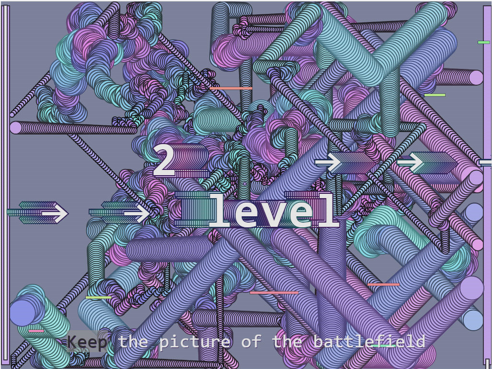
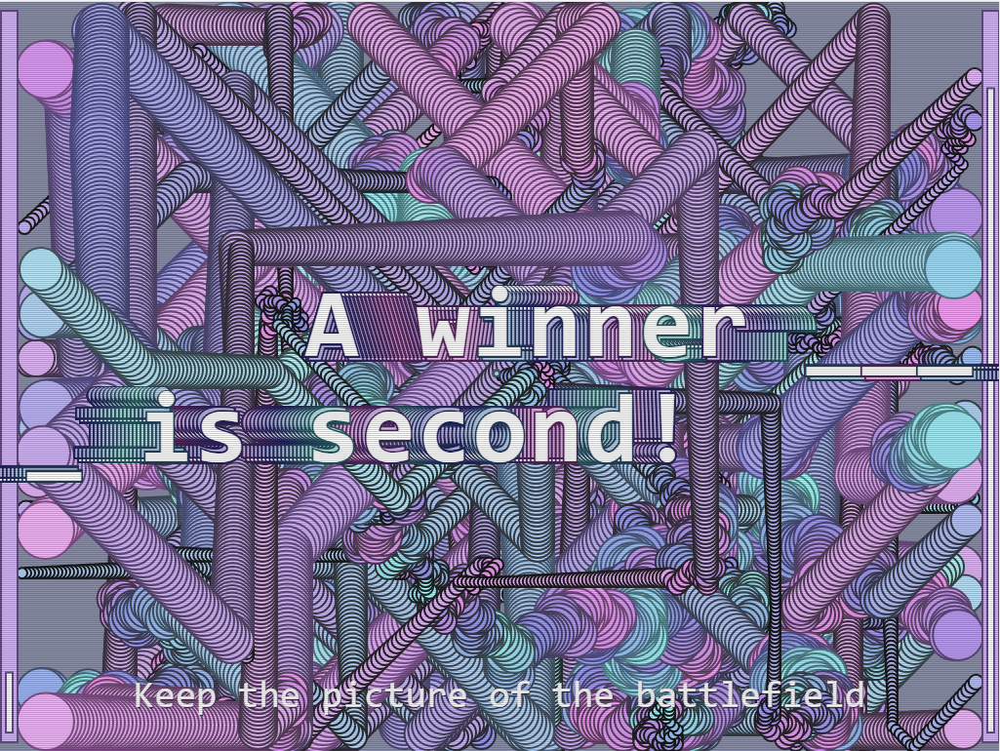

# Druzhba pipeline. Great game
Great russian game

Развивает скорость принятия решений. Цель - загнать трубу в противную сторону. Зажимаешь кнопку мыши - летит. Если летит не в ту сторону - отпускаешь кнопку. Краснее труба - длиннее летит. Зеленее - короче. За больший диаметр трубы - больше очков. С каждым уровнем усиливается ветер в харю. Можно играть в две хари без ветра.

[kukaew.github.io/pipeline](https://kukaew.github.io/pipeline/)
